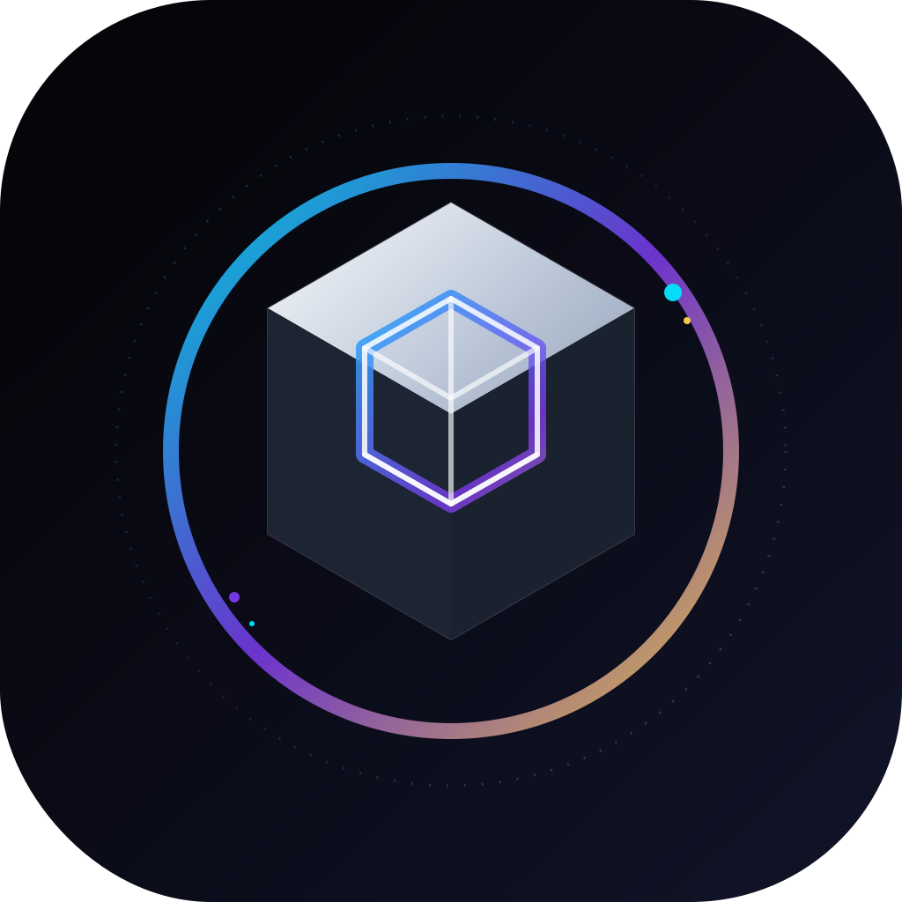

<p align="center">
  
</p>

<h1 align="center">GiftOS Core</h1>

<p align="center">
  <strong>The Operating System for Digital Gift Card Markets.</strong>
</p>

<p align="center">
  A premium open infrastructure platform for gift card trading, market intelligence, automation, and treasury management.
</p>

<p align="center">
  
  
  
</p>

---

## Vision

Become the **Bloomberg Terminal for Digital Gift Cards**.

## Design Language

- **Primary:** Obsidian Black
- **Accent:** Electric Cyan
- **Secondary:** Aurora Violet
- **Highlight:** Liquid Gold
- **Style:** Luxury fintech, cyber-glass, cinematic dark mode

## Core Experience

- Elegant dashboard with premium spacing and deep contrast
- Floating cards, soft glows, gradient borders, and glass surfaces
- Clean data grids for market intelligence and trades
- Fast mobile-first interface with a premium app shell

## Assets

- Logo: `assets/logo.svg`
- Favicon: `assets/favicon.svg` *(recommended next)*
- Social preview: `assets/og-cover.png` *(recommended next)*

## Features

| Module | Status | Description |
|--------|--------|-------------|
| Market Intelligence | 🚧 In Progress | Real-time price tracking across Apple, Amazon, Steam, Google Play |
| AI Pricing | 📋 Planned | ML-driven fair value estimation |
| Portfolio Engine | 📋 Planned | Multi-account inventory & PnL tracking |
| Analytics | 📋 Planned | Time-series dashboards & trade analytics |
| Exchange Connectors | 🚧 In Progress | NoOnes API integration (OAuth, Offers, Trades, Wallet, Webhooks) |
| REST API | 📋 Planned | Full-featured developer API |
| Automation | 📋 Planned | Alerts, WhatsApp, Telegram bots |

## Architecture

```
                    ┌─────────────────────────────────┐
                    │           GiftOS Core           │
                    └──────────────┬──────────────────┘
                                   │
          ┌────────────────────────┼────────────────────────┐
          │                        │                        │
   ┌──────▼──────┐        ┌────────▼────────┐      ┌───────▼──────┐
   │   Market    │        │    Trading      │      │   Analytics  │
   │ Intelligence│        │     Engine      │      │   & Reports  │
   └──────┬──────┘        └────────┬────────┘      └──────────────┘
          │                        │
   ┌──────▼──────┐        ┌────────▼────────┐
   │  AI Pricing │        │ Portfolio Engine│
   └─────────────┘        └──────┬──────────┘
                                │
                    ┌───────────┴───────────┐
                    │  Exchange Connectors  │
                    │  NoOnes · OTC · Ent.  │
                    └───────────────────────┘
```

## Quick Start

```bash
# Clone
git clone https://github.com/giftos/giftos-core.git
cd giftos-core

# Environment
cp .env.example .env
# Edit .env with your credentials

# Run with Docker
docker-compose up --build

# Or local development
pip install -e ".[dev]"
uvicorn giftos.main:app --reload
```

## API Documentation

Once running, visit:
- **Swagger UI**: http://localhost:8000/docs
- **ReDoc**: http://localhost:8000/redoc

## Roadmap

| Milestone | Target | Deliverable |
|-----------|--------|-------------|
| M1 | Q3 2026 | Market Intelligence (Apple, Amazon, Steam, Google Play) |
| M2 | Q3 2026 | NoOnes Connector (OAuth, Offers, Trades, Wallet, Webhooks) |
| M3 | Q4 2026 | Dashboard — Live Prices, Charts, Portfolio, Inventory |
| M4 | Q4 2026 | Automation — AI Pricing, Alerts, WhatsApp, Telegram |
| M5 | Q1 2027 | Developer Platform — REST API, Python SDK, JS SDK |

## Tech Stack

| Layer | Technology |
|-------|-----------|
| API Framework | FastAPI (async) |
| Database | PostgreSQL + TimescaleDB |
| Cache | Redis |
| Task Queue | Celery + Redis |
| Frontend | Next.js + Tailwind CSS |
| Charts | TradingView Lightweight Charts |
| Containers | Docker + Compose |
| CI/CD | GitHub Actions |

## Contributing

See [CONTRIBUTING.md](CONTRIBUTING.md) and [CODE_OF_CONDUCT.md](CODE_OF_CONDUCT.md).

## Security

See [SECURITY.md](SECURITY.md) for vulnerability reporting.

## License

Apache-2.0 — See [LICENSE](LICENSE) for details.

---

**GiftOS** — Open infrastructure for digital gift card markets.
